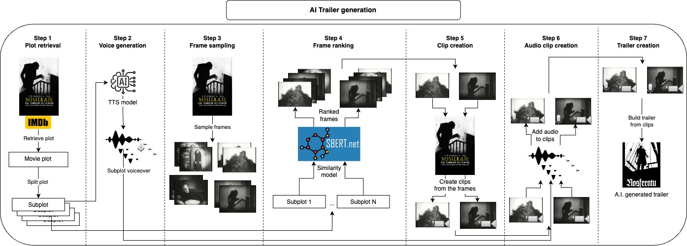

# Automatic trailer generation using AI



---

### I have written a couple of blog post related to this project make sure to check them
- [Creating Movie Trailers With AI](https://medium.com/towards-artificial-intelligence/creating-movie-trailers-with-ai-bb5c3d89f4e3) describes the project in more details
- [Using Gemini 1.5 Pro to create video trailers](https://dimitreoliveira.medium.com/using-gemini-1-5-pro-to-create-video-trailers-1fff6fc768c8) explores the usage of Gemini 1.5 Pro video capabilities on this same project

---

The idea of this repository is to automatically generate a number of trailer candidates for a given video, the user only needs to provide the video file and a couple of text parameters, and everything else is taken care.

### How does it works?
First, we optionally take the video's plot at IMDB and split it into subplots, instead of taking at from IMDB you could also provide your own plot or modify it, those subplots will roughly describe the main parts of the video, and next, we generate a voice for each subplot. Now that we have the spoken part of the trailer we just need to take short clips corresponding to each subplot and apply the voice over them, we do this by sampling many frames from the video and taking some of the most similar frames to each subplot, with this we have the images that best represent each subplot, the next step would be to take a clip of a few seconds starting from each frame. After generating the audio and visual part of the trailer we just need to combine each audio with the corresponding clip and finally join all clips together into the final trailer.

All of those steps will generate intermediate files that you can inspect and manually remove what you don't like to improve the results.

> Note: with the default parameters, for each subplot only one audio and one clip will be generated thus creating only one trailer candidate. If you wish to create more trailer candidates or have more options of audios and clips to choose from, you can increase `n_audios` and `n_retrieved_images`, just keep in mind that the trailer candidates increase geometrically with this, for `n_audios = 3` and `n_retrieved_images = 3` you will have 9 (3**3) trailer candidates at the end.

# Examples
### Night of the Living Dead (1968)
[](https://youtu.be/qNt4fQlEHPA)

### Nosferatu (1922)
[](https://youtu.be/bfUdjzndOyI)

### The Fermi Paradox — Where Are All The Aliens?
[](https://youtu.be/Ay0mKR6_WBE)

### Natural History Museum (New Dinosaur Exhibit) Walking Tour in 4K -- Washington, D.C.
[](https://youtu.be/vQk5vEl2PXY)

# Changelog
- 2024/03/03 - Added support to create trailers for any video not only movies.
- 2024/03/07 - Added support to download videos from YouTube.

# Usage
The recommended approach to use this repository is with [Docker](https://docs.docker.com/), but you can also use a custom venv, just make sure to install all dependencies.

**The user only needs to provide two inputs**, the video file and the IMDB ID from that video.
After that you can go to the `configs.yaml` file and adjust the values accordingly, `video_id` will be the IMDB ID, and `video_path` should point to the video's file, you might also want to update `project_name` to your video's name and provide a reference voice with `reference_voice_path`.

## How to get the IMDB ID for a video?
Any movie's URL at IMDB will look like this "https://www.imdb.com/title/tt0063350", the ID will be the **integer part** after `title/`, in this case for "Night of the Living Dead" it would be `0063350`, IMDB mainly has movie's informations but you can also find series' episodes and other videos.

## Application workflow
1. **Video retrieval (optional):** Download the video from YouTube
2. **Plot retrieval (optional):** Get the video's plot from IMDB
3. **Subplot split:** Split the plot into subplots
4. **Voice generation:** Generate a voice for each subplot
5. **Frame sampling:** Sample multiple frames from the video
6. **Frame ranking:** Select the frames most similar to each subplot
7. **Clip:** Create a video clip for each of the frames selected
8. **Audio clip:** Add the voice generated at step 2 to each corresponding clip
9. **Join clip:** Join all the audio clips to build the trailer

## Configs
```
project_dir: 'projects'
project_name: Natural_History_Museum
video_path: 'movies/Natural_History_Museum.mp4'
plot_filename: 'plot.txt'
video_retrieval:
  video_url: 'https://www.youtube.com/watch?v=fdcEKPS6tOQ'
plot_retrieval:
  video_id: 
subplot:
  split_char:
voice:
  model_id: 'tts_models/multilingual/multi-dataset/xtts_v2'
  device: cpu
  reference_voice_path: 'voices/sample_voice.wav'
  tts_language: en
  n_audios: 1
frame_sampling:
  n_frames: 500
frame_ranking:
  model_id: 'clip-ViT-B-32'
  device: cpu
  n_retrieved_images: 1
  similarity_batch_size: 128
clip:
  min_clip_len: 3
audio_clip:
  clip_volume: 0.1
  voice_volume: 1.0
```

- **project_dir**: Folder that will host all your projects
- **project_name**: Project name and main folder, it can be any name that you want
- **video_path**: Path to the video file
- **plot_filename**: File name that will keep the video plot
- **video_retrieval**:
    - **video_url**: Optional URL from a YouTube video
- **plot_retrieval**:
    - **video_id**: Optional IMDB ID for the video
- **subplot**:
    - **split_char**: Optional character used to split the plot text
- **voice**:
    - **model_id**: TTS mode ID, here I am using [Coqui AI](https://github.com/coqui-ai/TTS?tab=readme-ov-file#running-a-multi-speaker-and-multi-lingual-model)
    - **device**: Devices used by the TTS and similarity models, usually one of (cpu, cuda, mps)
    - **reference_voice_path**: Path to the reference audio file (voice that will be cloned)
    - **tts_language**: Language input for the TTS model
    - **n_audios**: Number of audios to generate per subplot
- **frame_sampling**:
    - **n_frames**: Number of frames to sample from the video
- **frame_ranking**:
    - **model_id**: Similarity model used to rank the frames
    - **device**: Devices used by the TTS and similarity models, usually one of (cpu, cuda, mps)
    - **n_retrieved_images**: Number of retrieved frames per subplot
    - **similarity_batch_size**: Batch size used by the similarity model to embed the frames
- **clip**:
    - **min_clip_len**: Minimum length of a clip
- **audio_clip**:
    - **clip_volume**: Percentage of the original clip volume to be kept for the final clip
    - **voice_volume**: Percentage of the generated voice volume to be kept for the final clip

## Commands
Build the Docker image
```bash
make build
```

Run the whole pipeline to create the trailer starting from a video and a plot
```bash
make trailer
```

Run the whole pipeline to create the trailer starting from a video and retrieving the plot from IMDB
```bash
make trailer_imdb
```

Run the whole pipeline to create the trailer starting from a plot and downloading the video from YouTube
```bash
make trailer_youtube
```

Run the whole pipeline to create the trailer downloading the video from YouTube and retrieving the plot from IMDB
```bash
make trailer_imdb_youtube
```

Run the video retrieval step
```bash
make video_retrieval
```

Run the plot retrieval step
```bash
make plot_retrieval
```

Run the subplot step
```bash
make subplot
```

Run the voice step
```bash
make voice
```

Run the frame step (Frame sampling)
```bash
make frame
```

Run the image_retrieval step (Frame ranking)
```bash
make image_retrieval
```

Run the clip step
```bash
make clip
```

Run the audio_clip step
```bash
make audio_clip
```

Run the join_clip step
```bash
make join_clip
```

Apply lint and formatting to the code (only needed for development)
```bash
make lint
```

# Development
For development make sure to install `requirements-dev.txt` and run `make lint` to maintain the the coding style.

# Disclaimers
By default I am using [XTTS](https://huggingface.co/coqui/XTTS-v2) from [Coqui AI](https://github.com/coqui-ai/TTS) the model is under the [Coqui Public Model License](https://coqui.ai/cpml) make sure to take a look there if you plan to use the outputs here.
