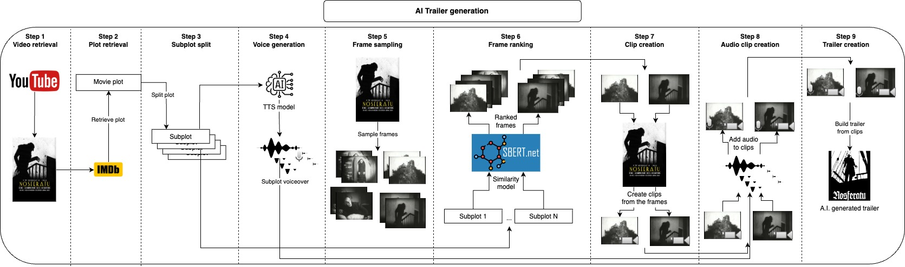

# Automatic trailer generation using AI



---

The idea of this repository is to automatically generate a number of trailer candidates for a given movie, the user only needs to provide the movie file and a couple of text parameters, and everything else is taken care.

### How does it works?
First, we take the movie's plot at IMDB and split it into subplots, they will roughly describe the main parts of the movie, and next, we generate a voice for each subplot. Now that we have the spoken part of the trailer we just need to take short clips corresponding to each subplot and apply the voice over them, we do this by sampling many frames from the movie and taking some of the most similar frames to each subplot, with this we have the images that best represent each subplot, the next step would be to take a clip of a few seconds starting from each frame. After generating the audio and visual part of the trailer we just need to combine each audio with the corresponding clip and finally join all clips together into the final trailer.

All of those steps will generate intermediate files that you can inspect and manually remove what you don't like to improve the results.

> Note: with the default parameters, for each subplot only one audio and one clip will be generated thus creating only one trailer candidate. If you wish to create more trailer candidates or have more options of audios and clips to choose from, you can increase `n_audios` and `n_retrieved_images`, just keep in mind that the trailer candidates increase geometrically with this, for `n_audios = 3` and `n_retrieved_images = 3` you will have 9 (3**3) trailer candidates at the end.

# Examples
### Night of the Living Dead (1968)
[](https://youtu.be/qNt4fQlEHPA)

### Nosferatu (1922)
[](https://youtu.be/bfUdjzndOyI)

# Usage
The recommended approach to use this repository is with [Docker](https://docs.docker.com/), but you can also use a custom venv, just make sure to install all dependencies.

**The user only needs to provide two inputs**, the movie file and the IMDB ID from that movie.
After that you can go to the `configs.yaml` file and adjust the values accordingly, `movie_id` will be the IMDB ID, and `movie_path` should point to the movie's file, you might also want to update `project_name` to your movie's name and provide a reference voice with `reference_voice_path`.

## How to get the IMDB ID for a movie?
Any movie's URL at IMDB will look like this "https://www.imdb.com/title/tt0063350", the ID will be the **integer part** after `title/`, in this case for "Night of the Living Dead" it would be `0063350`.

## Application workflow
1. **Plot:** Get the movie's plot from IMDB and split it into subplots
2. **Voice:** Generate a voice for each subplot
3. **Frame sampling:** Sample multiple frames from the movie
4. **Frame ranking:** Select the frames most similar to each subplot
5. **Clip:** Create a video clip for each of the frames selected
6. **Audio clip:** Add the voice generated at step 2 to each corresponding clip
7. **Join clip:** Join all the audio clips to build the trailer


## Configs
```
project_name: night_of_the_living_dead
project_dir: './projects'
movie_path: 'movies/night_of_the_living_dead.mp4'
plot_filename: 'plot.txt'
movie_id: '0063350'
device: cpu
tts_model_id: 'tts_models/multilingual/multi-dataset/xtts_v2'
tts_language: en
reference_voice_path: './voices/the_narrator.wav'
n_audios: 1
n_frames: 1000
similarity_model_id: 'clip-ViT-B-32'
n_retrieved_images: 1
similarity_batch_size: 128
min_clip_len: 5
clip_volume: 0.5
voice_volume: 1.0
```
- **project_name**: Project name and main folder, it can be any name that you want
- **project_dir**: Folder that will host all your projects
- **movie_path**: Path to the movie file
- **plot_filename**: File name that will keep the movie plot
- **movie_id**: IMDB ID for the movie
- **device**: Devices used by the TTS and similarity models, usually one of (cpu, cuda, mps)
- **tts_model_id**: TTS mode ID, here I am using [Coqui AI](https://github.com/coqui-ai/TTS?tab=readme-ov-file#running-a-multi-speaker-and-multi-lingual-model)
- **tts_language**: Language input for the TTS model
- **reference_voice_path**: Path to the reference audio file (voice that will be cloned)
- **n_audios**: Number of audios to generate per subplot
- **n_frames**: Number of frames to sample from the movie
- **similarity_model_id**: Similarity model used to rank the frames
- **n_retrieved_images**: Number of retrieved frames per subplot
- **similarity_batch_size**: Batch size used by the similarity model to embed the frames
- **min_clip_len**: Minimum length of a clip
- **clip_volume**: Percentage of the original clip volume to be kept for the final clip
- **voice_volume**: Percentage of the generated voice volume to be kept for the final clip

## Commands
Build the Docker image
```bash
make build
```

Run the whole pipeline to create the trailer
```bash
make trailer
```

Run the plot step
```bash
make plot
```

Run the voice step
```bash
make voice
```

Run the frame step (Frame sampling)
```bash
make frame
```

Run the image_retrieval step (Frame ranking)
```bash
make image_retrieval
```

Run the clip step
```bash
make clip
```

Run the audio_clip step
```bash
make audio_clip
```

Run the join_clip step
```bash
make join_clip
```

Apply lint and formatting to the code (only needed for development)
```bash
make lint
```

# Development
For development make sure to install `requirements-dev.txt` and run `make lint` to maintain the the coding style.

# Disclaimers
By default I am using [XTTS](https://huggingface.co/coqui/XTTS-v2) from [Coqui AI](https://github.com/coqui-ai/TTS) the model is under the [Coqui Public Model License](https://coqui.ai/cpml) make sure to take a look there if you plan to use the outputs here.